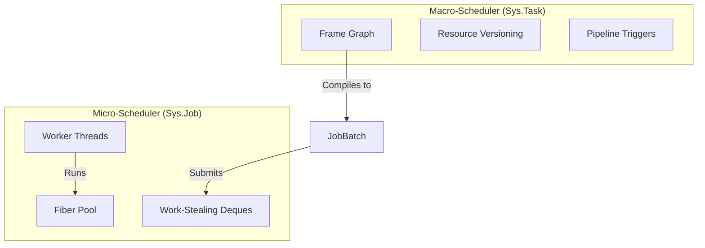

# Concinna Engine: Architecture Specification - The Ouroboros Task System

**版本**: 3.0 (Final)
**模块**: `Sys.Task` / `Sys.Job`
**架构代号**: **Ouroboros (衔尾蛇)**

---

## **1. 设计哲学 (Design Philosophy)**

本架构旨在彻底摒弃传统的“主循环（Game Loop）”范式，构建一个**自我驱动、深度流水线化、确定性**的并行计算运行时。

1.  **无循环架构 (No-Loop Architecture)**: 引擎不再由 `while(true)` 驱动。整个运行时是一个永不停歇的异步状态机。上一帧的关键节点完成，直接触发下一帧的起始节点。
2.  **深度流水线 (Deep Pipelining)**: 通过跨帧依赖链，实现 CPU 逻辑帧与 GPU 渲染帧的完全重叠（Overlapping）。Frame $N+1$ 的模拟可以在 Frame $N$ 的渲染尚未结束时启动。
3.  **M:N 纤程调度**: 消除 OS 线程切换开销，利用纤程（Fiber）实现微秒级任务切换。
4.  **PCSC 执行模型**: **P**arallel **C**ompute, **S**equential **C**ommit。计算乱序，提交有序，确保工业级的确定性和可回溯性。

---

## **2. 系统分层 (System Hierarchy)**

系统由底向高分为两层：**微观执行层（Micro-Scheduler）**与**宏观流图层（Macro-Scheduler）**。



---

## **3. 微观执行层: Sys.Job**

`Sys.Job` 是底层的算力引擎，负责将计算任务映射到物理核心。

### **3.1 核心原语**

*   **`JobDesc`**: 描述一个计算单元。
    *   `entry`: 函数指针。
    *   `data`: 上下文指针。
    *   `affinity`: **线程亲和性**（关键）。
*   **`Fiber`**: 执行上下文。支持 `switch_to` 和 `yield`。
*   **`Counter`**: 依赖计数器。`wait()` 操作触发 Fiber 挂起而非线程阻塞。

### **3.2 线程模型与亲和性**

为了兼容 OS（特别是 Windows/macOS）对窗口消息处理的限制，Worker 线程被分为两类：

1.  **Main Worker (Thread 0)**:
    *   **职责**: 唯一的 `OS_Thread`。负责处理 `Prm.Window` 消息泵、`Prm.HID` 轮询、以及部分必须在主线程调用的图形 API（如 SwapChain Present）。
    *   **调度策略**: 优先处理 `affinity == MainThread` 的任务，空闲时窃取普通任务。
2.  **Compute Workers (Thread 1..N)**:
    *   **职责**: 纯算力。处理物理、逻辑、渲染录制。
    *   **调度策略**: 仅处理 `affinity == Any` 的任务。

---

## **4. 宏观流图层: Sys.Task**

`Sys.Task` 定义了引擎的逻辑拓扑结构。它管理资源版本和跨帧触发。

### **4.1 资源版本控制 (Resource Versioning)**

由于流水线重叠，Frame $N$ 和 Frame $N+1$ 会同时运行，必须对资源进行多缓冲（Multi-Buffering）。

*   **资源句柄**: `ResHandle` 不直接指向内存，而是指向一个 `VersionedSlot`。
*   **自动轮转**:
    *   系统维护 `GlobalFrameIndex`。
    *   `Res::Transform` 内部有 3 个槽位（Triple Buffering）。
    *   Task 在 Frame $N$ 访问资源时，系统自动映射到 `Slot[N % 3]`。

### **4.2 任务节点与触发器**

任务图不再是静态的单帧 DAG，而是包含**跨帧触发器**。

```rust
pub struct TaskNode {
    pub name: String,
    pub inputs: Vec<ResHandle>,
    pub outputs: Vec<ResHandle>,
    pub affinity: ThreadAffinity,
    pub triggers: Vec<Trigger>, // 任务完成后触发什么？
}

pub enum Trigger {
    NextTask(TaskID),           // 触发当前帧的后续任务
    NextFrameRoot(TaskID),      // 触发下一帧的根任务 (流水线关键)
}
```

---

## **5. 衔尾蛇执行模型 (The Ouroboros Model)**

这是“无循环”架构的核心实现。

### **5.1 启动 (Kickstart)**

`main` 函数不再包含循环，它只是点火器。

```rust
fn main() {
    let engine = Concinna::init();
    let graph = build_ouroboros_graph();

    // 点火：提交第 0 帧的 Input 任务
    engine.scheduler.submit(graph.root_task(), FrameIndex(0));

    // 主线程降级为 Worker，进入死循环调度，直到收到 Exit 信号
    engine.scheduler.join_worker_pool(); 
}
```

### **5.2 链式反应 (Chain Reaction)**

假设一帧的主要阶段为：`Input` -> `Sim` -> `Render` -> `Present`。

1.  **Frame $N$ Input**: 运行在 Main Worker。完成后触发 `Sim`。
2.  **Frame $N$ Sim**: 运行在 Compute Workers (并行)。
    *   **关键点**: `Sim` 完成时，产生两个分支信号：
        *   信号 A: 触发 **Frame $N$ Render** (当前帧继续)。
        *   信号 B: 触发 **Frame $N+1$ Input** (下一帧开始)。
3.  **流水线状态**:
    *   此时，GPU 正在处理 Frame $N-1$。
    *   CPU 正在录制 Frame $N$ 的 Command Buffer。
    *   CPU 同时正在处理 Frame $N+1$ 的输入和物理。

### **5.3 流量控制 (Backpressure)**

为了防止 CPU 跑得太快（例如 CPU 1000fps，GPU 60fps），导致内存耗尽，需要在跨帧触发器中加入**背压机制**。

*   **Frame Fence**: 系统维护一个 `MaxFrameAhead` (例如 2)。
*   如果 `FrameIndex(N) - CompletedFrame(GPU) > 2`，则 `Sim` 任务在触发下一帧 Input 前会挂起当前 Fiber，直到 GPU 追上来。

---

## **6. 确定性与副作用 (Determinism & PCSC)**

为了支持时间倒流，任务内部执行必须遵循 PCSC 原则。

### **6.1 Map-Reduce 模式**

对于需要修改 `SimHeap`（全局状态）的任务：

1.  **Map (Parallel)**:
    *   输入：只读的 `SimHeap` (Frame $N$)。
    *   执行：乱序并行。
    *   输出：`ThreadLocal<CommandBuffer>`。记录“我要移动 Entity A”、“我要播放声音 B”。
    *   **约束**: 严禁直接写入 `SimHeap`。

2.  **Reduce (Sequential)**:
    *   输入：所有 Worker 的 CommandBuffer。
    *   执行：单线程（或确定性并行归并）。
    *   逻辑：按 Ticket 顺序将 Command 应用到 `SimHeap` (Frame $N+1$)。

### **6.2 隔离沙盒 (Sandboxing)**

*   **Job 隔离**: 对于脚本任务，分配独立的 `ScratchAllocator`。
*   **崩溃恢复**: 如果某个 Job 触发 Panic/Segfault（通过 Signal Handler 捕获），系统丢弃该 Job 的 CommandBuffer，回滚该 Job 的状态，并标记 Entity 为“损坏”，但**引擎主进程不崩溃**。

---

## **7. API 设计预览**

### **7.1 定义图谱**

```rust
let mut graph = TaskGraph::new();

// 1. 输入任务 (必须在主线程)
let t_input = graph.add_task("Input")
    .affinity(ThreadAffinity::Main)
    .write(Res::InputBuffer)
    .exec(|ctx| { Prm::HID::poll(); });

// 2. 模拟任务 (并行)
let t_sim = graph.add_task("Simulation")
    .read(Res::InputBuffer)
    .read(Res::SimState_Old)
    .write(Res::SimState_New)
    .run_map_reduce(sim_map_fn, sim_reduce_fn);

// 3. 渲染任务 (并行录制)
let t_render = graph.add_task("Render")
    .read(Res::SimState_New)
    .write(Res::CmdBuffer)
    .exec(render_record_fn);

// 4. 呈现任务 (必须在主线程)
let t_present = graph.add_task("Present")
    .affinity(ThreadAffinity::Main)
    .read(Res::CmdBuffer)
    .exec(|ctx| { Prm::WSI::present(); });

// 定义依赖与触发
graph.dependency(t_input, t_sim);
graph.dependency(t_sim, t_render);
graph.dependency(t_render, t_present);

// 关键：定义衔尾蛇链接 (Ouroboros Link)
// 当 Sim 完成时，自动触发下一帧的 Input
graph.chain_frames(t_sim, t_input);
```

---

## **8. 总结**

**Concinna Ouroboros** 架构通过以下方式重新定义了游戏引擎的运行时：

1.  **消灭主循环**：将运行时转化为纯粹的依赖驱动流。
2.  **主线程 Worker 化**：巧妙解决了 OS 限制与并行效率的冲突。
3.  **资源多缓冲**：支撑了 CPU/GPU 的深度流水线重叠。
4.  **PCSC 模型**：在极致并行的同时，保留了完美的确定性和可调试性。

这是实现“工业级时空模拟器”的终极形态。