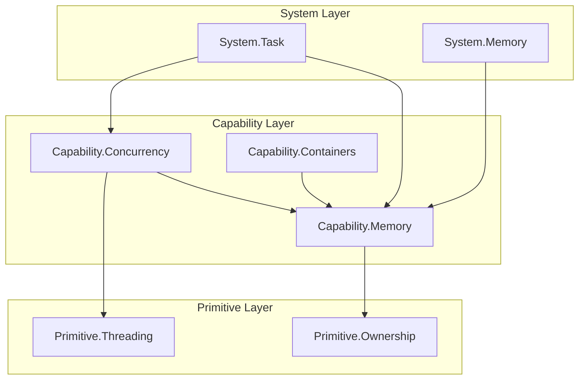

这是一个非常符合**第一性原理**和**分层架构**（Language -> Primitive -> Capability -> System）的重构思路。

目前的 `Capability.Concurrency` 和 `Capability.Memory` 确实承担了过多的职责：既包含了**机制（Mechanism）**（如分配算法、无锁队列），又包含了**策略与状态（Policy & State）**（如全局调度器实例、全局内存统计）。

根据你的架构规范，建议进行如下重构：

---

### 1. Memory 体系重构

**目标**：将“怎么分配内存”（算法）与“管理内存分配器”（统计、生命周期、调试）分离。

#### **Capability.Memory (保留与增强)**
*   **定位**：纯粹的内存分配**机制**。无全局状态，不持有锁（除非是分配器内部逻辑），不依赖 System 层。
*   **内容**：
    *   `IMemoryResource` 接口。
    *   具体实现：`PoolAllocator`, `StackAllocator`, `FrameAllocator`, `TLSFAllocator`。
    *   `Allocator` 句柄。
    *   `AddressSanitizer` 钩子封装。
*   **变化**：移除任何 `GetProcessDefault()` 之外的全局访问点。

#### **System.Memory (新增)**
*   **定位**：内存系统的**管理者**。负责全局状态、配置、监控。
*   **内容**：
    *   **`MemoryManager`**：单例/全局上下文。负责初始化底层的 `Heap` 和 `VirtualMemory`。
    *   **`AllocatorRegistry`**：所有活跃分配器在此注册。用于 GUI 显示内存占用图表。
    *   **`MemoryProfiler`**：收集所有注册分配器的 `GetStats()`，计算总带宽、峰值、碎片率。
    *   **`GlobalAllocators`**：持有整个引擎生命周期的根分配器（如 `SystemAllocator` 实例）。
    *   **`LeakDetector`**：在 Shutdown 时遍历注册表，检查未释放内存。

**代码示意 (System.Memory):**

```cpp
// System.Memory
namespace Sys {
    struct MemoryManager {
        // 注册分配器以供统计
        static void Register(Cap::IMemoryResource* allocator, const char* name, const char* category);
        static void Unregister(Cap::IMemoryResource* allocator);

        // 获取全局统计
        static void SnapshotStats(MemoryStats& out);
        
        // 获取预定义的全局分配器
        static Cap::Allocator General(); // 通用堆
        static Cap::Allocator Scratch(); // 临时/帧分配器
    };
}
```

---

### 2. Containers 体系重构

**目标**：容器是数据结构，它们应该位于 `Capability` 层，但需要依赖 `Capability.Memory`。

#### **Capability.Containers (新增/重构)**
*   **定位**：通用的数据结构库。
*   **依赖**：`Language`, `Primitive`, `Capability.Memory`。
*   **内容**：
    *   **`Array<T>`, `Vector<T>`, `HashMap<K,V>`**：基于 `Cap::Allocator` 的标准容器。
    *   **`String`**：动态字符串（区别于 `Text` 模块的 `StringView`）。
    *   **`IntrusiveList`, `IntrusiveTree`**：侵入式容器（高性能，无内存分配）。
*   **关于并发容器**：
    *   建议将 `MPMCQueue`, `LockFreeStack` 等放入 `Capability.Containers.Concurrent` 分区，而不是放在 Concurrency 模块中。因为它们本质是数据结构。

---

### 3. Concurrency 体系重构 (大手术)

目前的 `Capability.Concurrency` 混合了底层原语（Fiber）、中间件（Queue）和顶层系统（Scheduler）。

#### **Primitive.Threading (保持)**
*   **内容**：OS 线程、Futex、Context Switch (汇编)、Thread Local Storage 原语。

#### **Capability.Concurrency (瘦身)**
*   **定位**：并发编程的**工具库**。无全局状态。
*   **内容**：
    *   **`Fiber` 类**：封装 `Primitive` 的 Context，管理 Stack 内存（依赖 `Cap.Memory`）。
    *   **`Job` / `Task` 定义**：`struct Job { ... }`。
    *   **`Future` / `Promise`**：异步结果的抽象。
    *   **`Coroutines`**：如果使用 C++20 协程，相关的 `task<T>` 类型定义在此。
    *   **`SyncPrimitives`**：`SpinLock`, `TicketLock` 等高级锁（基于 `Prm.Sync` 实现）。

#### **System.Task (或 System.Concurrency)**
*   **定位**：**调度器子系统**。拥有线程、管理 CPU 拓扑、驱动 IO。
*   **内容**：
    *   **`Scheduler`**：(原 `Capability.Concurrency.Scheduler`)。
        *   管理 `Worker` 线程池。
        *   持有 `GlobalQueue`。
        *   负责 `Topology` 绑定（NUMA 感知）。
    *   **`Executor`**：执行具体的 Job 逻辑。
    *   **`IOReactor`**：(原 `Driver`)。负责 `epoll` / `IOCP` 循环，并唤醒 Scheduler 的 Worker。
*   **原因**：调度器是引擎的“心脏”，它有极其厚重的状态（线程、队列内存、IO 句柄），并且需要控制整个引擎的生命周期（Init/Shutdown），完全符合 `System` 层的定义。

---

### 4. 依赖关系图

重构后的依赖流向更加清晰：



### 5. 具体的重构建议

1.  **移动 JobSystem**:
    *   将 `Scheduler`, `Worker`, `Driver` (IOCP/Epoll) 移动到 `System.Task`。
    *   `System.Task` 初始化时，从 `System.Memory` 申请大块内存用于 Fiber 栈池。

2.  **抽象 IO 驱动**:
    *   目前的 `Driver` 紧耦合在 Concurrency 中。
    *   在 `System.Task` 中，`Driver` 应该是一个插件或策略。
    *   `System.Task` 负责 `Poll()`，并将 IO 完成事件转化为 `Job` 推入队列。

3.  **容器与内存的结合**:
    *   `Capability.Containers` 中的容器（如 `Vector`）构造函数必须强制要求传入 `Cap::Allocator`。
    *   禁止使用 `new/delete` 或 `std::allocator`。

4.  **全局分配器注册**:
    *   在 `Cap::IMemoryResource` 的构造函数中（或者通过一个 Mixin），可以调用 `Sys::MemoryManager::Register(this)`。
    *   **注意依赖倒置**：`Capability` 不能依赖 `System`。
    *   **解决方案**：
        *   方案 A（侵入式）：`IMemoryResource` 有一个 `SetName(const char*)`，但注册逻辑由使用者在创建后手动调用 `Sys::Register`。
        *   方案 B（回调）：`System` 层初始化时，设置一个全局的 `ProfileCallback` 函数指针到 `Capability` 层。`Allocator` 创建时如果该指针非空，则调用之。

### 总结

*   **Memory**: 拆分。`Cap` 做机制，`Sys` 做管理/统计/全局实例。
*   **Containers**: 独立为 `Capability.Containers`，依赖 `Cap.Memory`。
*   **Concurrency**: 拆分。`Cap` 做 Job/Fiber 定义和无锁算法，`Sys` 做调度器（Scheduler）和 IO 驱动。