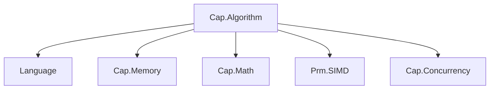

# Capability.Algorithm 模块详细设计 (V2.0 - No-STL & Parallel)

## 1. 核心变更点

*   **去 STL 化 (De-STL)**：完全移除 `<algorithm>`、`<iterator>` 依赖。手写基础算法（Copy, Fill, Find, Sort），针对 `Span` 和指针进行极致优化（利用 `memmove`、SIMD）。
*   **并发集成 (Concurrency Integration)**：引入 `Cap.Concurrency` 依赖。核心算法（排序、空间划分、压缩）增加 `Parallel` 策略。
*   **执行策略 (Execution Policy)**：引入 `Seq` (串行) 和 `Par` (并行) 策略标签，统一接口风格。

## 2. 模块依赖图



## 3. 目录结构

```
Capability/Algorithm/
├── API/
│   ├── Algorithm.ixx       # 模块伞头
│   ├── Policy.ixx          # 执行策略 (Seq, Par)
│   ├── Primitives.ixx      # 基础算法 (Copy, Fill, Find, Transform) - 替代 STL
│   ├── Sort.ixx            # 排序 (IntroSort, RadixSort, ParallelRadixSort)
│   ├── Scan.ixx            # 扫描与归约 (PrefixSum, Reduce) - 并行算法基石
│   ├── Compression.ixx     # 压缩 (Block-Parallel LZ4/Zstd)
│   └── Spatial.ixx         # 空间划分 (LBVH, Morton)
├── Impl/
│   ├── Primitives/         # SIMD 优化的基础操作
│   ├── Sort/               # 排序实现
│   └── Spatial/            # BVH 构建实现
└── Samples/
```

## 4. 核心子模块设计

### 4.1 Policy (执行策略)

定义算法是跑在单线程还是通过 Job System 跑在多线程。

```cpp
export namespace Cap::Algo {
    struct ExecutionPolicy {
        enum class Mode : UInt8 { Sequential, Parallel };
        Mode mode;
        // 可选：传入 TaskGroup 或 Context 以控制并发粒度
        void* context{nullptr}; 
    };

    inline constexpr ExecutionPolicy Seq{ ExecutionPolicy::Mode::Sequential };
    inline constexpr ExecutionPolicy Par{ ExecutionPolicy::Mode::Parallel };
}
```

### 4.2 Primitives (基础原语 - STL 替代者)

这是最底层的“搬砖”代码，必须极其高效。

**API 设计**:

```cpp
export namespace Cap::Algo {
    // 内存操作 (自动检测 TriviallyCopyable 优化为 memmove)
    template<typename T>
    void Copy(Span<const T> src, Span<T> dst) noexcept;

    template<typename T>
    void Fill(Span<T> dst, const T& value) noexcept;

    // 查找与遍历
    template<typename T, typename Predicate>
    T* FindIf(Span<T> range, Predicate pred) noexcept;

    template<typename T, typename Func>
    void ForEach(Span<T> range, Func func) noexcept;

    // 并行遍历 (依赖 Cap.Concurrency)
    // 内部自动分块(Chunking)并提交 Job
    template<typename T, typename Func>
    void ForEach(ExecutionPolicy policy, Span<T> range, Func func) noexcept;
}
```

**实现细节**:
*   **SIMD 优化**: `Find` 和 `Fill` 针对基础类型（int, float）使用 `Prm.SIMD` 进行 8/16 路并行处理。
*   **Unrolling**: 循环展开以减少分支预测失败。

### 4.3 Scan & Reduce (并行算法基石)

并行排序和构建 BVH 的核心依赖于 **Prefix Sum (前缀和)**。

**API 设计**:

```cpp
export namespace Cap::Algo {
    // 归约 (Sum, Max, Min)
    template<typename T, typename Op>
    T Reduce(ExecutionPolicy policy, Span<const T> input, T init, Op op) noexcept;

    // 排他前缀和 (Exclusive Scan)
    // In:  [1, 2, 3, 4]
    // Out: [0, 1, 3, 6]
    // 并行版通常采用 Up-Sweep (Reduce) + Down-Sweep 阶段
    template<typename T>
    void ExclusiveScan(ExecutionPolicy policy, Span<const T> input, Span<T> output, T init) noexcept;
}
```

### 4.4 Sort (高性能排序)

**API 设计**:

```cpp
export namespace Cap::Algo {
    // 通用比较排序 (IntroSort: QuickSort + HeapSort fallback)
    // 替代 std::sort
    template<typename T, typename Compare>
    void Sort(Span<T> range, Compare comp) noexcept;

    // 并行基数排序 (Parallel Radix Sort)
    // 核心：这是游戏引擎中最快的排序，用于 RenderKey, Particle, EntityID
    struct RadixSortContext {
        Allocator* alloc; // 必须显式传入分配器
        // ... 内部缓存
    };

    template<typename K, typename V>
    void RadixSort(ExecutionPolicy policy, 
                   Span<K> keys, 
                   Span<V> values, 
                   RadixSortContext& ctx) noexcept;
}
```

**并行 Radix Sort 实现思路**:
1.  **Histogram (直方图)**: 将数据分块，每个 Job 统计自己块的直方图（L1 Cache 友好）。
2.  **Global Offset**: 对所有 Job 的直方图做 Prefix Sum，计算全局写入偏移。
3.  **Scatter (重排)**: 每个 Job 根据偏移将数据写入目标数组。
4.  **Ping-Pong**: 在输入和辅助 buffer 间切换。

### 4.5 Spatial (空间划分)

LBVH 的构建天然适合并行化。

**API 设计**:

```cpp
export namespace Cap::Algo {
    struct LBVHNode { /* ... */ };

    struct LBVHBuilder {
        // 并行构建 LBVH
        // 1. 并行计算 Morton Codes
        // 2. 并行 Radix Sort
        // 3. 并行构建层级 (基于 Morton Code 的位差异)
        static Status Build(ExecutionPolicy policy,
                            Span<const AABB> primitives, 
                            Span<const Vector3> centers, 
                            Span<LBVHNode> outNodes, 
                            Allocator& scratch) noexcept;
    };
}
```

## 5. 关键技术难点与解决方案

### 5.1 粒度控制 (Granularity Control)
*   **问题**：如果数据量太小（例如 100 个元素），强行并行反而因为 Job 调度开销变慢。
*   **解法**：
    *   **自动阈值**：在 `Impl` 中定义 `kMinParallelSize`（例如 4096）。低于此阈值时，即使传入 `Par` 策略，内部也自动回退到 `Seq`。
    *   **自适应分块**：根据 `Cap.Concurrency::WorkerCount()` 动态决定分块大小。

### 5.2 伪共享 (False Sharing)
*   **问题**：并行算法（如 Histogram 统计）中，多个线程写入相邻的内存地址。
*   **解法**：
    *   使用 `Prm.Sync:CacheLine` 对齐。
    *   每个 Job 使用线程局部（栈上或 Scratch Allocator）的直方图，最后再合并。

### 5.3 异常安全与错误处理
*   **原则**：算法层不抛出异常。
*   **解法**：
    *   对于逻辑错误（如 Buffer 太小），使用 `ASSERT`。
    *   对于运行时错误（如内存耗尽），函数返回 `Status` 或 `Expect`。
    *   `ForEach` 等模板函数不返回错误，假设用户逻辑自行处理。

## 6. 示例代码：并行粒子更新与排序

```cpp
// 粒子系统 Update 伪代码
void ParticleSystem::UpdateAndSort(float dt) {
    USize count = m_particles.size();
    
    // 1. 并行更新位置 (ForEach)
    Cap::Algo::ForEach(Cap::Algo::Par, m_particles.Span(), [dt](Particle& p) {
        p.velocity += p.force * dt;
        p.position += p.velocity * dt;
    });

    // 2. 准备排序键值 (计算到摄像机的距离平方)
    // 使用 FrameAllocator 分配临时内存
    auto keys = m_frameAlloc.Alloc<UInt32>(count);
    auto indices = m_frameAlloc.Alloc<UInt32>(count);
    
    // 并行计算 Key
    Cap::Algo::ForEach(Cap::Algo::Par, m_particles.Span(), [&](const Particle& p, USize idx) {
        float distSq = DistanceSquared(p.position, m_camPos);
        // Float 转 UInt 用于 RadixSort (需处理浮点位表示)
        keys[idx] = FloatFlip(distSq); 
        indices[idx] = idx;
    });

    // 3. 并行基数排序 (只排索引)
    Cap::Algo::RadixSortContext ctx(m_frameAlloc);
    Cap::Algo::RadixSort(Cap::Algo::Par, keys.Span(), indices.Span(), ctx);

    // 4. 根据排序后的索引重排粒子 (可选，或者渲染时直接用 indices)
    // Cap::Algo::Gather(Cap::Algo::Par, m_particles, indices, m_sortedParticles);
}
```

## 7. 总结

V2.0 的设计完全摒弃了 STL，将 **Concurrency** 提升为一等公民。这使得 `Capability.Algorithm` 不再是一个简单的工具库，而是引擎高性能计算的**加速器**。它连接了底层的 `Memory`、`SIMD` 和 `Concurrency`，为上层的 `Physics`、`Renderer` 和 `Gameplay` 提供了坚实的算力基础。